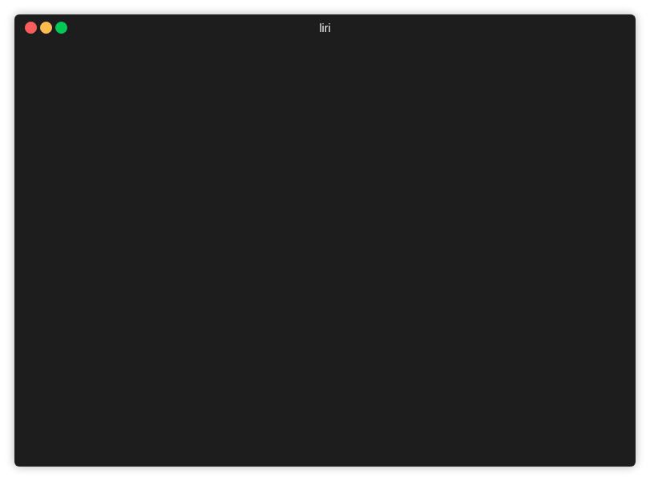

# liri-node-app

## About
This app has the power to 
- search Bands in Town for concert locations
- search Spotify for information about a song
- search OMDB for information about a movie
- Queue commands in ```random.txt``` if you have multiple searches to do
- Will log results into ```log.txt```

## Installation
```
$ git clone git@github.com:mputterf/liri-node-app.git 
$ cd liri-node-app
$ npm install
```

## Usage
```
$ node liri <concert-this/spotify-this-song/movie-this/do-what-it-says> <search terms>
```

## Examples
### node liri concert-this


### node liri.js spotify-this-song
`spotify-this-song` will search for The Sign by Ace of Base if no search term is given


### node liri.js movie-this
`movie-this` will search for Mr. Nobody if no search term is given


### node liri.js do-what-it-says
